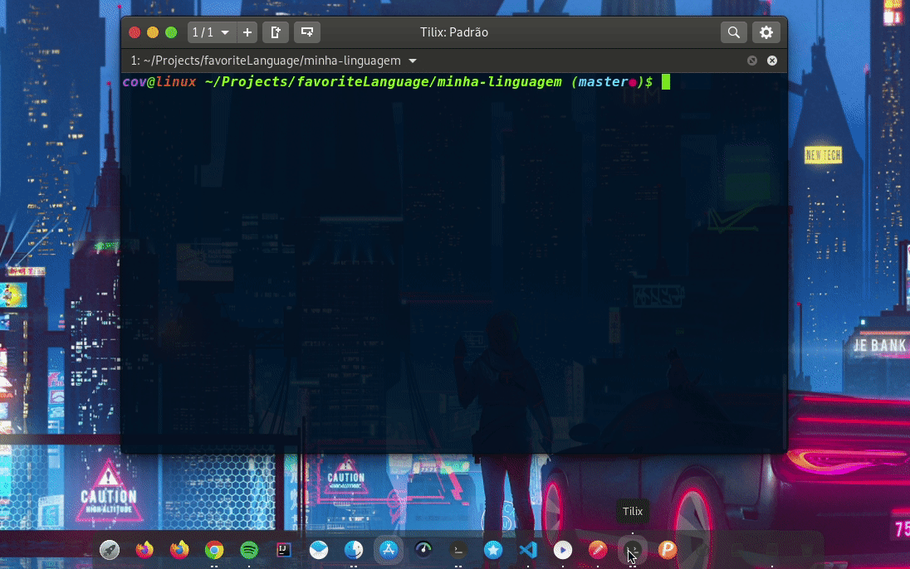

 <h1 align="center">
 
  
 
 
Minha Linguagem Favorita
</h1>

Nesse projeto veremos a implementação de sistema de login e cadastro completo em uma aplicação SPA, ou Single-page application, utilizando o framework Angular e o padrão JWT, ou JSON Web Token. Essa aplicação se trata de um Dashboard onde podemos visualizar uma lista de linguagens de programação e curtir aquelas que mais gostamos. Podemos, também, visualizar o número de curtidas em cada uma dessas linguagens, bem como um gráfico de pizza com a distribuição do total de curtidas dentre essas linguagens.

Para a interface utilizamos a biblioteca Bootstrap, que forneceu o sistema de Grid (contêiner, linhas e colunas), o menu superior, as core, o cartão onde mostraremos os dados das linguagens e a estilização dos formulários. Além disso, utilizamos o pacote ngx-toastr para exibir mensagens de sucesso e erro para o usuário e o pacote ng2-charts para a construção do gráfico de pizza.

  

[//]: # (Add your gifs/images here:)

  
  

## :rocket: Technologies
[//]: # (Add the features of your project here:)
This application uses Angular a front-end web framework
 

**Angular** — A TypeScript based open-source web application framework.

## Getting started

Describe here the way to use/install your project
 

## License

This project is licensed under the MIT License - see the [LICENSE](https://opensource.org/licenses/MIT) page for details.

